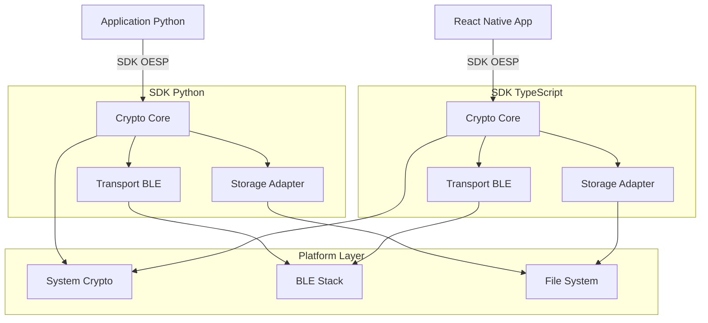
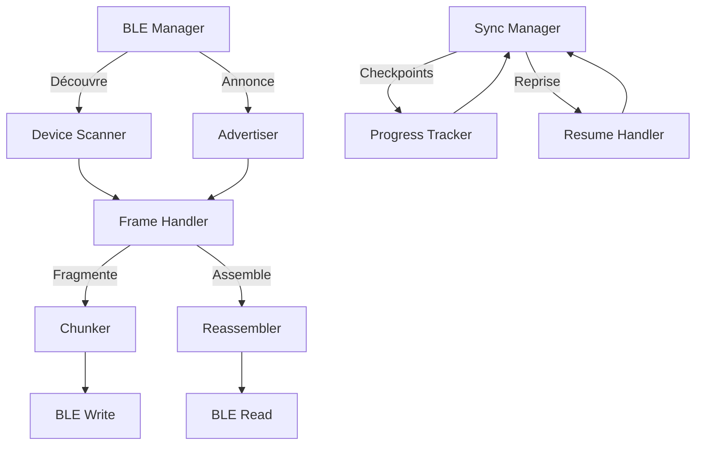
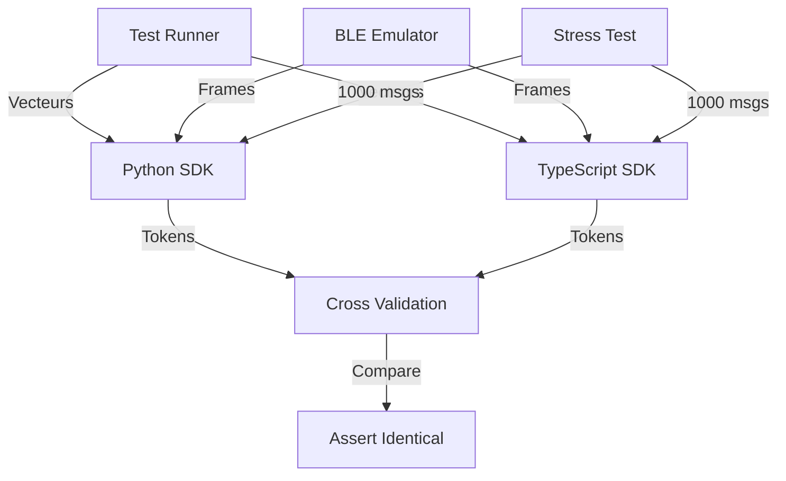

## 1. Architecture globale



## 2. Stack technologique

### SDK Python
- **Version** : Python 3.8+
- **Crypto** : cryptography>=41.0.0, PyNaCl>=1.5.0
- **BLE** : bleak>=0.20.0 (cross-platform)
- **Tests** : pytest>=7.4.0, pytest-asyncio>=0.21.0
- **Typage** : mypy>=1.5.0, typing-extensions>=4.7.0
- **Build** : setuptools>=68.0.0, wheel>=0.41.0

### SDK TypeScript
- **Runtime** : React Native 0.70+
- **Crypto** : react-native-quick-crypto>=0.6.0, react-native-nacl>=1.3.0
- **BLE** : react-native-ble-plx>=2.0.3
- **Tests** : jest>=29.6.0, @types/jest>=29.5.0
- **Build** : typescript>=5.1.0, metro>=0.76.0
- **Lint** : eslint>=8.45.0, @typescript-eslint/parser>=6.2.0

## 3. Structure des modules

### 3.1 Crypto Core

| Module | Dépendances | Responsabilités |
|--------|-------------|------------------|
| Identity | Ed25519, base32 | Génération DID, gestion clés |
| Envelope | JSON canonique | Sérialisation format OESP v1 |
| Signature | Ed25519pure | Sign/verify avec déterminisme |
| KEX | X25519, sealed box | Établissement secret partagé |
| AEAD | ChaCha20-Poly1305 | Chiffrement authentifié |

### 3.2 Transport Layer



### 3.3 Storage Adapters

| Platform | Adapter | Chiffrement | Isolation |
|----------|---------|-------------|-----------|
| Python | Keyring + SQLite | AES-256-GCM | Process sandbox |
| React Native | Keychain + MMKV | AES-256-GCM | App sandbox |

## 4. Définitions de types

### 4.1 Types TypeScript principaux

```typescript
interface Identity {
  did: string;
  keyPair: {
    publicKey: Uint8Array;
    privateKey: Uint8Array;
  };
}

interface EnvelopeV1 {
  v: 1;
  typ: "message" | "ack" | "kex";
  mid: string; // UUID
  sid: string; // Session ID
  ts: number; // Unix timestamp ms
  exp: number; // Unix timestamp ms
  from: {
    did: string;
    pub: string; // base64url
  };
  to: {
    did: string;
  };
  enc: "cha20-poly";
  kex: "x25519";
  ek: string; // Encrypted key base64url
  iv: string; // IV base64url
  ct: string; // Ciphertext base64url
  sig_alg: "ed25519";
  sig: string; // Signature base64url
}

interface OESPClientConfig {
  storageAdapter: StorageAdapter;
  cryptoProvider: CryptoProvider;
  bleTransport?: BLETransport;
}
```

### 4.2 Types Python équivalents

```python
from typing import TypedDict, Literal
from dataclasses import dataclass

@dataclass
class Identity:
    did: str
    key_pair: KeyPair

class EnvelopeV1(TypedDict):
    v: Literal[1]
    typ: Literal["message", "ack", "kex"]
    mid: str
    sid: str
    ts: int
    exp: int
    from_: dict[str, str]  # did, pub
    to: dict[str, str]    # did
    enc: Literal["cha20-poly"]
    kex: Literal["x25519"]
    ek: str
    iv: str
    ct: str
    sig_alg: Literal["ed25519"]
    sig: str
```

## 5. Architecture des tests

### 5.1 Vecteurs de test cryptographiques

- **Sources** : RFC 8032 (Ed25519), RFC 8439 (ChaCha20-Poly1305)
- **Format** : JSON avec entrées/sorties hex encodées
- **Coverage** : 100% des chemins crypto critiques
- **Performance** : Benchmarks sur opérations 1K messages

### 5.2 Tests d'intégration cross-platform



## 6. Modèle de données

### 6.1 Schéma de persistance

```mermaid
erDiagram
    IDENTITY ||--o{ MESSAGE : sends/receives
    IDENTITY ||--o{ SESSION : participates
    SESSION ||--o{ MESSAGE : contains
    
    IDENTITY {
        string did PK
        string public_key
        string private_key_encrypted
        datetime created_at
        datetime last_used
    }
    
    SESSION {
        string sid PK
        string participant_did
        string shared_secret_encrypted
        datetime established_at
        datetime expires_at
    }
    
    MESSAGE {
        string mid PK
        string sid FK
        string sender_did
        string recipient_did
        string token_oesp
        datetime timestamp
        boolean is_processed
    }
```

### 6.2 DDL SQLite (Python)

```sql
-- Identities table
CREATE TABLE identities (
    did TEXT PRIMARY KEY,
    public_key BLOB NOT NULL,
    private_key_encrypted BLOB NOT NULL,
    created_at TIMESTAMP DEFAULT CURRENT_TIMESTAMP,
    last_used TIMESTAMP DEFAULT CURRENT_TIMESTAMP
);

-- Sessions table
CREATE TABLE sessions (
    sid TEXT PRIMARY KEY,
    participant_did TEXT NOT NULL,
    shared_secret_encrypted BLOB NOT NULL,
    established_at TIMESTAMP DEFAULT CURRENT_TIMESTAMP,
    expires_at TIMESTAMP NOT NULL,
    FOREIGN KEY (participant_did) REFERENCES identities(did)
);

-- Messages table (anti-replay)
CREATE TABLE messages (
    mid TEXT PRIMARY KEY,
    sid TEXT,
    sender_did TEXT NOT NULL,
    recipient_did TEXT NOT NULL,
    token_oesp TEXT NOT NULL,
    timestamp TIMESTAMP DEFAULT CURRENT_TIMESTAMP,
    is_processed BOOLEAN DEFAULT FALSE,
    FOREIGN KEY (sid) REFERENCES sessions(sid)
);

-- Indexes for performance
CREATE INDEX idx_sessions_expires ON sessions(expires_at);
CREATE INDEX idx_messages_sender ON messages(sender_did);
CREATE INDEX idx_messages_timestamp ON messages(timestamp);
```

## 7. Gestion des erreurs

### 7.1 Hiérarchie des exceptions

```typescript
class OESPError extends Error {
  code: string;
  details?: any;
}

class CryptoError extends OESPError {}
class InvalidSignatureError extends CryptoError {}
class ExpiredMessageError extends OESPError {}
class DuplicateMessageError extends OESPError {}
class BLETransportError extends OESPError {}
class StorageError extends OESPError {}
```

### 7.2 Codes d'erreur standardisés

| Code | Description | Action recommandée |
|------|-------------|-------------------|
| CRYPTO001 | Signature invalide | Rejeter message, log sécurité |
| CRYPTO002 | Message expiré | Rejeter, notifier émetteur |
| CRYPTO003 | Message en double | Ignorer silencieusement |
| TRANSPORT001 | BLE déconnecté | Tentative reconnexion |
| STORAGE001 | Clé introuvable | Regénération identité |

## 8. Performance et benchmarks

### 8.1 Objectifs de performance

- **Génération DID** : < 50ms
- **Pack message 1KB** : < 100ms
- **Unpack + verify** : < 75ms
- **Chiffrement 100KB** : < 200ms
- **BLE transfer 500KB** : < 30s avec fragmentation

### 8.2 Optimisations

- **Crypto** : WASM pour RN, bindings natifs Python
- **Serialization** : Binary envelope optionnel pour gros payloads
- **Caching** : Secrets partagés mis en cache 24h
- **Compression** : LZ4 pour payloads >10KB