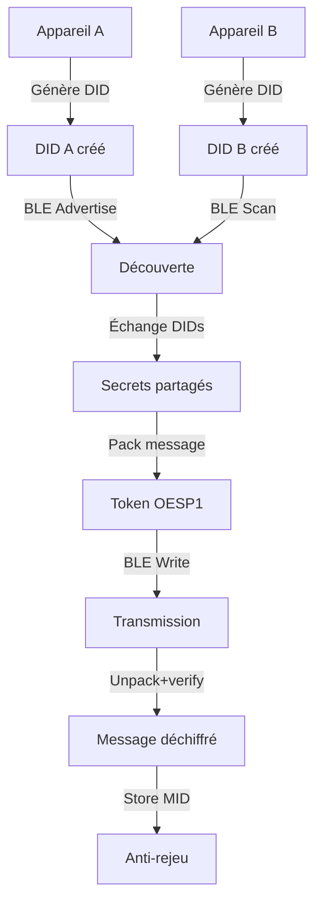

## 1. Vue d'ensemble du produit

OESP (Offline Exchange Secure Protocol) est un SDK de communication sécurisée offline multiplateforme permettant l'échange de données cryptographiques entre appareils sans connexion réseau.

Problème résolu : sécuriser les échanges de données entre appareils en environnement offline (PC-RN) avec cryptographie forte et cohérence parfaite entre plateformes. Cible : développeurs d'applications mobiles/desktop nécessitant des échanges sécurisés offline.

## 2. Fonctionnalités principales

### 2.1 Rôles utilisateurs

| Rôle | Méthode d'identification | Permissions principales |
|------|-------------------------|------------------------|
| Appareil émetteur | DID auto-généré (Ed25519) | Créer et signer des messages |
| Appareil destinataire | DID auto-généré (Ed25519) | Déchiffrer et vérifier des messages |
| Appareil relais | DID auto-généré (Ed25519) | Transmettre des messages entre appareils |

### 2.2 Modules fonctionnels

Le SDK OESP comprend les modules suivants :

1. **Gestion des identités** : génération DID, stockage sécurisé des clés
2. **Chiffrement/déchiffrement** : AEAD ChaCha20-Poly1305 avec KEX X25519
3. **Signature/verification** : Ed25519 pour l'authentification des messages
4. **Transport offline** : BLE avec fragmentation et reprise de synchronisation
5. **Validation** : anti-rejeu, expiration, format canonique

### 2.3 Détail des fonctionnalités

| Module | Fonctionnalité | Description |
|--------|---------------|-------------|
| Crypto Core | Génération DID | Créer DID format "oesp:did:" + base32(sha256(pubkey)) |
| Crypto Core | Signature Ed25519 | Signer l'enveloppe canonique avec clé privée |
| Crypto Core | Vérification signature | Valider signature avec clé publique du DID |
| Crypto Core | KEX X25519 | Établir secret partagé via sealed box |
| Crypto Core | Chiffrement AEAD | Chiffrer payload avec ChaCha20-Poly1305 |
| Envelope | Canonicalisation | Générer JSON canonique ordonné des champs |
| Envelope | Validation format | Vérifier champs requis v1 (v,typ,mid,sid,ts,exp,from,to,enc,kex,ek,iv,ct,sig_alg,sig) |
| Client | Pack message | Assembler token format "OESP1." + base64url |
| Client | Unpack message | Parser et valider token complet |
| Transport BLE | Fragmentation | Découper messages >500KB en frames |
| Transport BLE | Reconnexion | Reprendre synchronisation après interruption |
| Storage | Persistance clés | Stocker clés privées de manière sécurisée |
| Storage | Cache anti-rejeu | Mémoriser MID déjà traités |

## 3. Processus principaux

### Flux d'échange sécurisé

1. **Initialisation** : chaque appareil génère sa paire de clés Ed25519 et crée son DID
2. **Découverte** : échange de DIDs entre appareils via BLE
3. **Établissement sécurisé** : KEX X25519 pour secret partagé
4. **Envoi message** : chiffrement AEAD, signature, création token OESP1
5. **Réception message** : vérification signature, déchiffrement, validation anti-rejeu
6. **Confirmation** : acquittement du message reçu

## 4. Interface de programmation

### 4.1 Style de design API

- **Patterns** : Fluent interface pour chaînage d'opérations
- **Types** : Typescript strict / Python typing complet
- **Erreurs** : Exceptions spécifiques par type d'erreur crypto
- **Async** : Promises (TS) / coroutines (Python) pour opérations longues
- **Événements** : Callbacks pour progression BLE et sync

### 4.2 Structure API principale

| Classe | Méthodes principales | Paramètres |
|--------|---------------------|------------|
| OESPClient | generateIdentity() | void : Promise<Identity> |
| OESPClient | packMessage(payload, toDid) | payload: Uint8Array, toDid: string : Promise<string> |
| OESPClient | unpackMessage(token) | token: string : Promise<Message> |
| OESPClient | verifyMessage(message) | message: Message : Promise<boolean> |
| BLETransport | startAdvertising() | void : Promise<void> |
| BLETransport | startScan() | void : Promise<Device[]> |
| BLETransport | sendLargeData(data, device) | data: Uint8Array, device: Device : Promise<Progress> |

### 4.3 Compatibilité multiplateforme

- **Desktop** : Python 3.8+ avec support BLE natif
- **Mobile** : React Native 0.70+ avec react-native-ble-plx
- **Coherence** : Mêmes vecteurs de test, mêmes formats binaires
- **Performance** : < 100ms pour opérations crypto standard
- **Mémoire** : < 10MB footprint pour SDK complet

### 4.4 Sécurité et conformité

- **Random** : RNG cryptographique système uniquement
- **Timing** : Opérations constant-time pour crypto
- **Zeroisation** : Effacement sécurisé des clés en mémoire
- **Validation** : Tests de conformité FIPS 140-2 niveau 1
- **Audit** : Logging sécurisé des opérations critiques